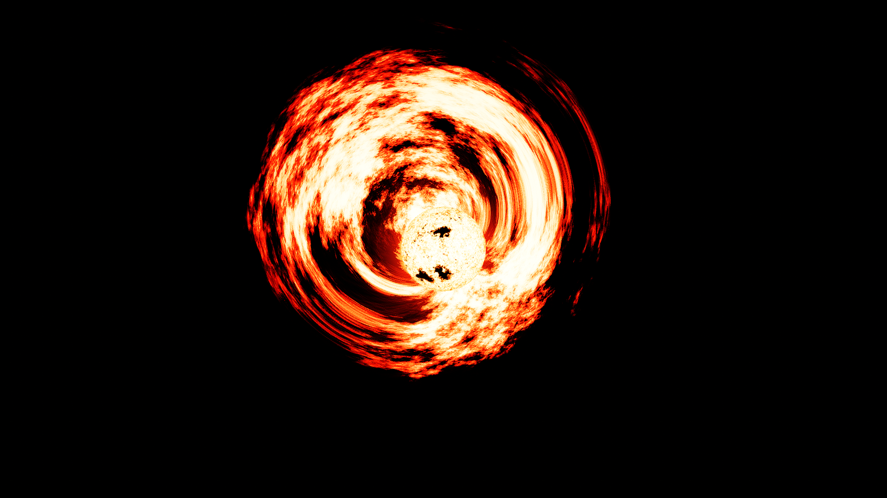

# Alison's Mod

## Preview

## Installing

Clone the repository and place it in the addons folder.

## Known Limitations

- All procedural stars have the same coronae period. This means flares will look stupidly slow on red dwarfs, bring this up with Vladimir, not me. Also, all stars will flare up at the same time.
- The flares have a low FPS. Same as above, but to fix this we also need some "time passed" variable passed to the shader, instead of just animation time, which can only be done by Vladimir.
- Coronae are 2D. This cannot be fixed.
